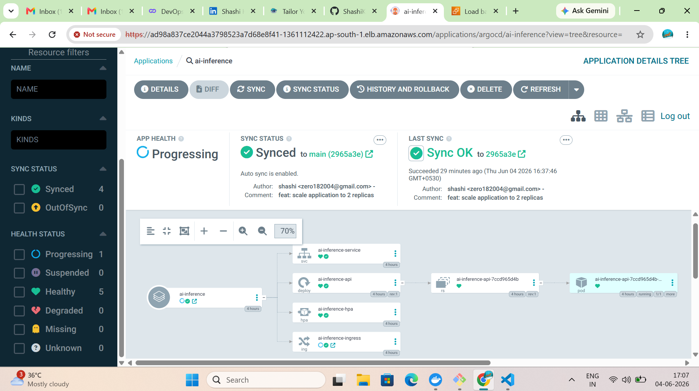
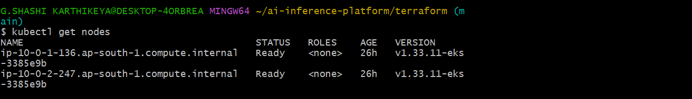
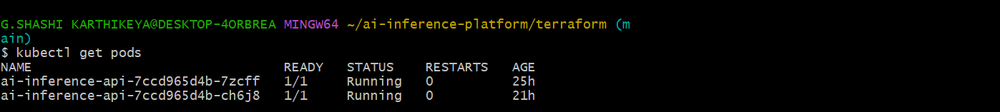
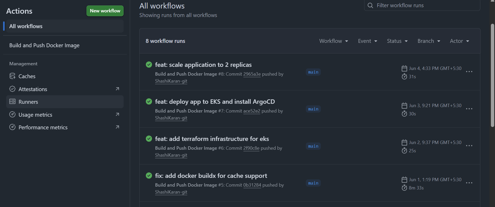

<div align="center">

# ☸️ Kubernetes AI Inference Platform

**A hands-on DevOps project deploying a FastAPI application on AWS EKS using a complete GitOps workflow.**


</div>

---

## 📌 Overview

This project provisions a cloud-native infrastructure on **AWS EKS** and deploys a **FastAPI** application using a fully automated GitOps pipeline. Infrastructure is managed with **Terraform**, deployments are packaged with **Helm**, and **ArgoCD** keeps the cluster in sync with the Git repository - no manual `kubectl apply` required.

GitOps was validated by modifying the Helm chart configuration, pushing changes to GitHub, and observing ArgoCD automatically synchronize the deployment to the EKS cluster.

Built as a hands-on project to learn how modern DevOps tooling works end-to-end — from `git push` to a running pod on Kubernetes.

---

## 🏗 Architecture

```
Developer
    │
    │  git push
    ▼
GitHub Repository
    │
    ├──► GitHub Actions
    │         │
    │         │  docker build + push
    │         ▼
    │      Docker Hub
    │
    └──► ArgoCD (GitOps Controller)
              │
              │  detects Helm chart changes
              ▼
           Helm Chart
              │
              ▼
        Amazon EKS Cluster
              │
        ┌─────┴─────┐
        │           │
      Pod 1       Pod 2        ← HPA scales based on CPU
        │           │
        └─────┬─────┘
              │
        Kubernetes Service
        (LoadBalancer)
              │
              ▼
            Users
```

---

## 📸 Screenshots


| ArgoCD Sync | EKS Nodes | Running Pods |
|:-----------:|:---------:|:------------:|
|  |  |  | 


---

## 🛠 Tech Stack

| Layer | Tool | Purpose |
|-------|------|---------|
| **Cloud** | AWS EKS, VPC, IAM, ELB | Managed Kubernetes cluster and networking |
| **IaC** | Terraform | Provision all AWS infrastructure declaratively |
| **Containers** | Docker, Docker Hub | Build and store application images |
| **Packaging** | Helm | Template and manage Kubernetes manifests |
| **GitOps** | ArgoCD | Automated, self-healing deployments from Git |
| **CI/CD** | GitHub Actions | Auto-build and push Docker images on push |
| **Autoscaling** | Kubernetes HPA | Scale pods based on CPU utilization |
| **Application** | Python, FastAPI | Lightweight API server |

---

## 📂 Project Structure

```
kubernetes-ai-inference-platform/
│
├── app/                          # FastAPI application
│   ├── main.py
│   ├── requirements.txt
│   └── Dockerfile
│
├── terraform/                    # AWS infrastructure (EKS, VPC, IAM)
│   ├── provider.tf
│   ├── vpc.tf
│   ├── eks.tf
│   ├── variables.tf
│   └── outputs.tf
│
├── ai-inference-chart/           # Helm chart for Kubernetes deployment
│   ├── templates/
│   │   ├── deployment.yaml
│   │   ├── service.yaml
│   │   ├── ingress.yaml
│   │   └── hpa.yaml
│   ├── Chart.yaml
│   └── values.yaml
│
├── .github/workflows/
│   └── docker-build.yaml         # GitHub Actions CI pipeline
│
└── README.md
```

---

## 🚀 Deployment Workflow

The project follows a structured deployment process across four stages:

### 1 · Provision Infrastructure

Terraform provisions the full AWS environment — VPC with public/private subnets, an EKS cluster, and a managed node group.

```bash
cd terraform
terraform init
terraform plan
terraform apply
```

### 2 · Connect to the Cluster

```bash
aws eks update-kubeconfig --region ap-south-1 --name ai-inference-cluster
kubectl get nodes
```

### 3 · Deploy the Application via Helm

```bash
helm upgrade --install ai-inference ./ai-inference-chart
kubectl get pods
kubectl get svc
```

### 4 · Install ArgoCD & Enable GitOps

```bash
kubectl create namespace argocd
kubectl apply --server-side -n argocd \
  -f https://raw.githubusercontent.com/argoproj/argo-cd/stable/manifests/install.yaml

# Expose the ArgoCD UI
kubectl patch svc argocd-server -n argocd -p '{"spec":{"type":"LoadBalancer"}}'

# Retrieve admin password
kubectl -n argocd get secret argocd-initial-admin-secret \
  -o jsonpath="{.data.password}" | base64 --decode
```

Once ArgoCD is connected to the repository, all future deployments happen automatically on `git push`.

---

## 🔄 GitOps Workflow

ArgoCD watches the Helm chart in this repository and syncs the cluster whenever changes are pushed.

**Sync settings configured:**

| Setting | Status |
|---------|--------|
| Auto Sync | ✅ Enabled |
| Prune | ✅ Enabled |
| Self Heal | ✅ Enabled |

**Verified end-to-end GitOps** by updating `replicaCount` in `values.yaml` from `1` → `2`, pushing to GitHub, and watching ArgoCD automatically scale the deployment — no manual intervention required.

```
git push
   └─► ArgoCD detects change
           └─► Helm chart re-applied
                   └─► Deployment updated in EKS
```

---

## 🚨 Challenges & Solutions

Real issues encountered during the build — and how they were fixed.

| # | Problem | Root Cause | Fix |
|---|---------|-----------|-----|
| 1 | `You must be logged in to the server` | IAM user not mapped to EKS cluster | Configured EKS Access Entries and granted `cluster-admin` via AWS console |
| 2 | `ImagePullBackOff` on pods | Wrong Docker image path in `values.yaml` | Corrected `image.repository` to match the exact Docker Hub image name |
| 3 | ArgoCD controller `CrashLoopBackOff` | Incomplete CRD installation from partial install | Deleted the namespace, removed stale CRDs, and performed a clean reinstall |
| 4 | `0/1 nodes available: Too many pods` | Single-node cluster exceeded pod capacity | Scaled the EKS managed node group from 1 → 2 nodes via Terraform |

---

## 🎓 Key Learnings

- **Terraform** — Writing modular IaC to manage VPC, EKS, and IAM from scratch
- **EKS** — Understanding managed node groups, access entries, and kubeconfig setup
- **Helm** — Templating Kubernetes manifests and managing releases with `upgrade --install`
- **ArgoCD** — Connecting a Git repository to a live cluster and configuring self-healing sync
- **GitOps** — The value of declarative config: changing a value in Git is the deployment
- **Debugging** — Reading pod events (`kubectl describe pod`) and logs to trace real errors

---

## 📈 Future Improvements

- [ ] **AWS ALB Ingress Controller** — Replace LoadBalancer service with ALB for path-based routing
- [ ] **Monitoring** — Add Prometheus & Grafana for cluster and application metrics
- [ ] **Centralized Logging** — EFK stack for log aggregation across pods
- [ ] **Terraform Remote State** — S3 + DynamoDB backend for safe team collaboration
- [ ] **TLS / HTTPS** — Automate certificates with cert-manager and Let's Encrypt
- [ ] **ArgoCD Rollouts** — Blue/green or canary deployments for zero-downtime releases

---

## 👤 Author

**Shashi Karthikeya**
Aspiring DevOps Engineer — learning by building real projects.

[](https://github.com/ShashiKaran-git)

---

<div align="center">
  <sub>Built with curiosity, debugged with patience.</sub>
</div>
